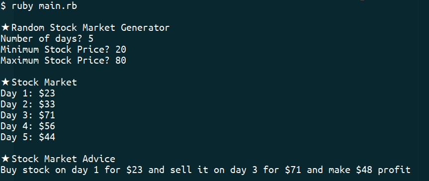

# Stock Picker (stock-picker)

> The goal of the project was to create a version of Stock Picker in Ruby that calulcates how to make maximum profit given a time series of stock market prices on successive days.

  

## Live Demo

]](https://repl.it/github/newhorizon-tech/stock-picker)

## Built With

- Ruby
- Atom
- Ruby Rubocop

## Authors

👤 **Alaukik**

- Github: [@newhorizon-tech](https://github.com/newhorizon-tech)
- Twitter: [@techintosh3](https://twitter.com/techintosh3)

## 🤝 Contributing

Contributions, issues and feature requests are welcome!

Feel free to check the [issues page](https://github.com/newhorizon-tech/stock-picker/issues).

## Show your support

Give a ⭐️ if you like this project!
